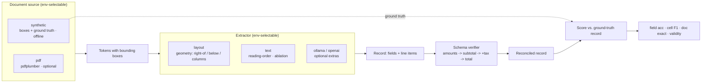

# DocuMind

[](https://github.com/ranafaraz/DocuMind/actions/workflows/ci.yml)
[](pyproject.toml)
[](LICENSE)

**Read documents the way they are laid out — and prove the layout is doing the work.**

DocuMind extracts structured records (key fields **and** line-item tables) from
documents — invoices, forms, receipts — using the page **geometry** an OCR engine
emits, not just the text. A layout-aware extractor associates each value with its
field by where it sits on the page; a **schema verifier** then reconciles the
record's arithmetic (line amounts → subtotal → +tax → total) and repairs values an
OCR glitch corrupted. Every extraction is scored against a **ground-truth record**,
so the claims are measured, not asserted.

It is **offline-first**: a deterministic generator synthesises documents *with
their bounding boxes and their answers*, so the whole benchmark — three doc types,
four configurations, a null test — runs green in CI with **no API keys and no
model downloads**. Real backends (a PDF reader, Ollama, OpenAI) are opt-in via pip
extras and degrade gracefully back to the offline path.

> The interesting question isn't "can a model read a document?" — it's **"what is
> the layout actually buying you?"** DocuMind separates two effects: *geometry*
> buys field-association accuracy, and a *schema verifier* buys arithmetic
> validity. Remove either and you can watch exactly which one you lost.

## Demo

```console
$ documind compare --doctype invoice --seed 1
DocuMind :: invoice (seed 1) :: ocr_noise=0.15
config               field  cellF1  exact  valid
layout             6/6        1.00    yes    yes
layout+verify      6/6        1.00    yes    yes
text               5/6        0.95     no    yes   <- misses Bill To (value below label)
text+verify        5/6        0.95     no    yes   <- and a wrapped table row

$ documind render --doctype form --seed 0      # why reading order fails
  y= 80: Name:  DOB:
  y= 94: Lina  Park  1971-10-17                 <- the value for "Name:" is BELOW it,
  y=124: ID:  City:                                not the next token in reading order
```


## Architecture



## The result that matters

Pooled across **180 documents** (60 seeds × 3 doc types), every document scored
against its ground-truth record, no API keys, no downloads:

| Config | Field acc | Cell F1 | Doc exact | Validity | Total acc |
|---|---:|---:|---:|---:|---:|
| text (reading-order) | 0.573 | 0.962 | 0.300 | 0.911 | 0.911 |
| text + verify | 0.588 | 0.962 | 0.333 | 1.000 | 1.000 |
| layout | 0.984 | 1.000 | 0.911 | 0.911 | 0.911 |
| **layout + verify** | **1.000** | **1.000** | **1.000** | **1.000** | **1.000** |

Two effects, cleanly separated:

- **Layout geometry buys field-association accuracy.** Holding the verifier on,
  the layout-aware extractor lifts field accuracy from **59% → 100%**. The gap is
  almost entirely the two-column **form**, where reading order interleaves the
  columns and the value for a label sits *below* it, not next to it
  (text **0%** vs layout **100%** on `form`).
- **The schema verifier buys arithmetic validity.** Holding the extractor on
  `layout`, the verifier lifts record validity **91% → 100%** and `total` accuracy
  **91% → 100%**, by recomputing the OCR-corrupted total from subtotal + tax —
  *independently* of which extractor produced the record.

### The null test (ablation)

Scramble every page's geometry and re-run the **same** layout extractor:

| layout + verify | Field acc | Cell F1 | Doc exact |
|---|---:|---:|---:|
| real geometry | 1.000 | 1.000 | 1.000 |
| **scrambled geometry** | **0.029** | 0.010 | 0.000 |

Field accuracy collapses **100% → 3%** — proof the extractor was reading the
page's geometry, not memorising text order. (Full per-doc-type breakdown in
[`evals/RESULTS.md`](evals/RESULTS.md).)

## Quickstart

```bash
python -m venv .venv && . .venv/bin/activate        # Windows: .venv\Scripts\activate
pip install -e ".[dev]"

pytest -q                    # 38 tests
python -m evals.harness      # full benchmark -> evals/RESULTS.md
python -m evals.gate         # CI quality gate (enforces the result's shape)

documind compare --doctype invoice --seed 1   # all four configs head-to-head
documind extract --doctype form    --seed 0   # one document, structured output
documind render  --doctype form    --seed 0 --scramble   # see the null test
```

One-command Docker run (offline):

```bash
docker build -t documind . && docker run --rm documind
```

## Document types

| Doc type | Layout | Why it's here |
|---|---|---|
| **form** | two-column grid, values **below** labels | Where reading order breaks worst — geometry is decisive |
| **invoice** | mixed: horizontal meta + `Bill To` block + line-item table | Realistic; tables include **wrapped** multi-line cells |
| **receipt** | single column, all horizontal `label: value` | The **control**: layout and reading order should agree |

Each document ships with its ground-truth record *and* token bounding boxes, so
field accuracy, table-cell F1, and arithmetic validity are all checkable offline.

## Backend matrix

| Component | Offline default | Optional real backend | Env var |
|---|---|---|---|
| Source | `synthetic` (boxes + truth) | `pdf` (`documind[pdf]`, pdfplumber) | `DOCUMIND_DOC_BACKEND` |
| Extractor | `layout` (geometry) | `ollama` (`[ollama]`), `openai` (`[openai]`) | `DOCUMIND_EXTRACTOR_BACKEND` |
| Verifier | on | — | `DOCUMIND_VERIFY` |

The same layout and text extractors run unchanged on a real PDF
(`documind extract-pdf file.pdf`) — `pdfplumber` simply supplies the
tokens-with-boxes the synthetic generator otherwise provides. Optional backends
are imported lazily and fall back to the offline path if a dependency, server, or
key is missing — selecting one can never crash the pipeline.

## Why this is honest

- **The ground truth is real.** Field accuracy, cell F1, and validity are scored
  against records we authored alongside the page geometry — not against another
  model's guess.
- **One pipeline, one independent variable.** The layout and text extractors share
  the same value-cleaning, label-finding, and table-region code; the *only*
  difference is geometry vs. reading order, so the head-to-head can't be rigged.
- **The verifier's effect is orthogonal.** It is the same code regardless of
  extractor, and it moves validity, not field association — which is why the two
  effects dissociate cleanly instead of blurring into one number.

See [`docs/ARCHITECTURE.md`](docs/ARCHITECTURE.md) and
[`docs/DECISIONS.md`](docs/DECISIONS.md) for the design write-up.

## License

MIT — see [LICENSE](LICENSE).
